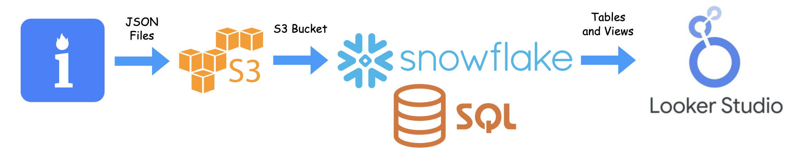
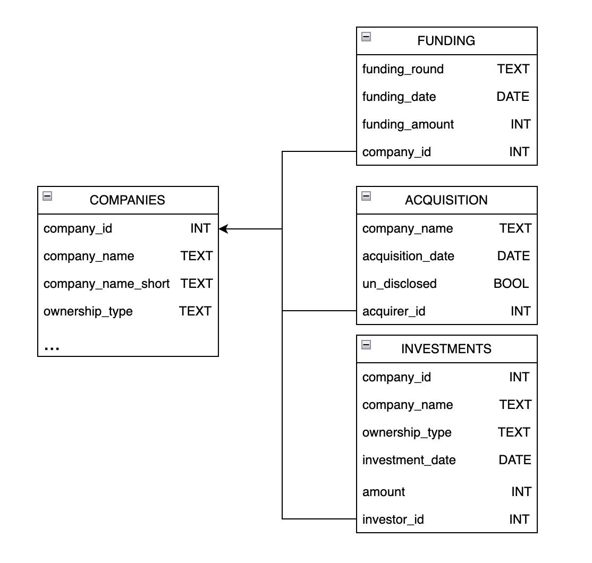

# Global Energy Sector Project

The full interactive dashboard is available [here](https://lookerstudio.google.com/s/gun7hoIApTQ).

## Table of Contents

- [Introduction](#introduction)
- [Project Overview](#project-overview)
- [Technologies Used](#technologies-used)
- [Data Collection](#data-collection)
- [Data Storage](#data-storage)
- [Data Processing](#data-processing)
- [Dashboard Creation](#dashboard-creation)

## Introduction

This document provides an overview of the project, the technologies used, and the steps required to set up, process, and visualize data from Bright Data, Amazon S3, Snowflake, and Looker Studio.

## Project Overview

The primary goal of this project is to collect data from Owler, a business information and insights platform, through web scraping on Bright Data. We will store the collected data in an Amazon S3 bucket, perform data processing and transformation using Snowflake, and create interactive dashboards for data visualization in Looker Studio.

## Technologies Used

- **Web Scraping**: Bright Data
- **Data Storage**: Amazon S3
- **Data Warehousing**: Snowflake and SQL
- **Dashboard Creation**: Looker Studio

## Data Collection
The list of companies used comes from the [The S&P Global Commodity Insights Top 250 Global Energy Company Rankings](https://www.spglobal.com/commodityinsights/top250/rankings). Using these companies, it is easy to create a web scraper from their template Owler scraper. Their application takes care of the difficult obstacles put in place to protect website data such as IP address detection, HTTP request header checking, CAPTCHAs, JavaScript checks, and more. The energy_companies.csv file contains the Owler links and company names of interest. Bright data allows you to upload this file on the last step before running the scraper provided the schemas (page tags) and features (link and company name columns) match. The scraper can be integrated with Amazon S3 to deliver the collected data to a bucket as a JSON file. 

## Data Storage
Amazon S3 buckets are public cloud storage containers for objects stored in simple storage service. In this project, an S3 bucket was create to host the JSON file containing the scraped data from Owler. When integrating S3 with 3rd party apps it is important to follow [recommended guidlines on authorization](https://docs.aws.amazon.com/AmazonS3/latest/userguide/security-best-practices.html).

## Data Processing
After integrating and setting up a policy and a role for Snowflake the data in the S3 bucket is retrievable. A stage should be created with the S3 credentials and the data can be unpacked into tables. Below is the schema chosen for this project: 

The code to unpack the JSON/create tables and create views is found in table_creations.sql and business_views.sql respectively. The views showcase example business insights using SQL queries and the tables will be used to generate dashboards.

## Dashboard Creation
 Looker Studio provides free visualization tools that connect directly to your data base. On top of this, it provides the ability to customize data sources without changing the data base. The first dashboard was created to show an overview of the global energy sector this year to date. It provides a high level overview of the top companies based on revnenue, timelines of funding and acquisitions, percentage of industries present in the list of companies, the tope investors, and each country's total revenue. The second dashboard offers dynamic insights to the user. It allows the user to see historical funding, acquisitions, and investments while being able to select for country, industry, and company revenue range. The full interactive dashboard is available [here](https://lookerstudio.google.com/s/gun7hoIApTQ).

---

Thank you for exploring this Data Engineering and Dashboard project! If you have any questions or need assistance, please don't hesitate to reach out.